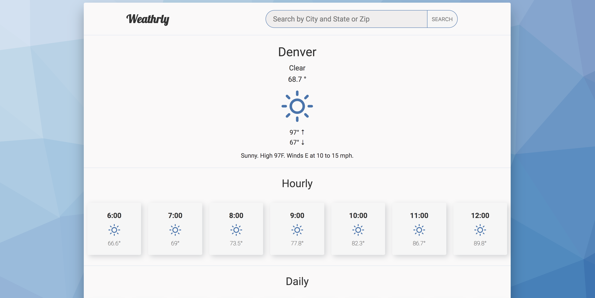
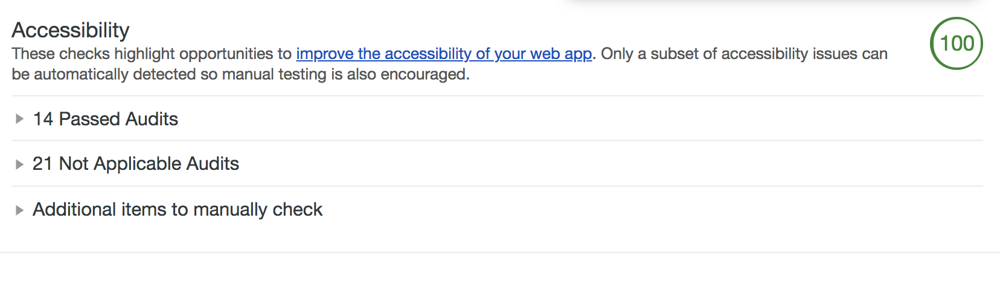

# Weathrly

## Context
It’s important to know what Mother Nature is going to throw at you each day – what if you wear flip flops because it’s sunny and 65 degrees in the morning and then it snows all afternoon (this is Colorado, after all).

As web developers you’re going to be living in the context of the web. With this next project you will be interacting with a web-api. Ultimately this is going to be a preview for what the real world is going to look like for most of you. Data is important and thats what the API provides. As a web-developer you will be giving value to that data by visualizing and organizing that data for your user base.

In this project you will be getting your first real interactions with ReactJS, asynchronous javascript, and managing the state of your application.

##### Demo

You can view the demo [here](weatherly-react.surge.sh).

##### **Required Technology**
ReactJS
fetch for api requests
weather underground API

Use create-react-app for your project. We’ll learn how to configure the testing environment in our testing lesson later this week.

## Requirements
Your weather underground API key should not be stored on github. Store it in a seperate file. This file should be added to your .gitignore file.

Your app should have at a minimum the following components.

**App**
**Welcome**
**Search**
**Current Weather**
**7 Hour Forecast**
**10 Day Forecast**
**Card (used in 7 hour and 10 day)**

#### Design

### LightHouse Accessibility Report
**Lighthouse Report is in the root of this project**

## Phase one
Create your Current Weather component

You will create your User Interface using mock data. This will speed up your development time by not waiting for api requests. You can find the mock data here. Copy it into a seperate file that you can then import into your App file.

Your Current Weather component should display the following information

1. ✅ The name of the current city
1. ✅ The current condition
1. ✅ The current day
1. ✅ The current temperature
1. ✅ The expected high and expected low for the day
1. ✅ A summary of what the weather is going to be like that day (“Windy, chance of a few late night showers. Lows overnight in the mid 50s.)

## Phase two

The application should have a 7 hour weather forecast component.

1. ✅ Each hour should be a card component and should display
the hour an image that reflects the weather the projected temperature

1. ✅ Application should handle when a user searches for a location that is not found by the API. Team should research different ways to handle unfound locations by looking around on different weather and other location searching applications and implement a solution for their project that they find intuitive.

## Phase three

The application should have a 10 day forecast component. Each day should be a card component and should display

1. ✅ The name of the day
1. ✅ An image that reflects the weather
1. ✅ The projected high and low temperature

## Phase four

1. ✅ Your application should have a welcome page that greets the user. The welcome page has a search component.

1. ✅ The search component consists of an input field and a submit button that allows the user to search for a location (the location should work with both a zip code and city/state).

1. ✅ Once the desired location is submitted there should be a way for the user to change location information. Once the location information is changed the weather should reflect the desired location.

1. location persists after refresh.

## Phase five

1. ✅ Add autocomplete functionality to your search input
import your completeMe into your Weathrly project. Populate it with this list of city/states.

1. ✅ When a user starts typing in a city/state or zip code display a list of possible suggestions using your completeMe’s suggest function.

## Extensions

1. If a user clicks on a specific day on the 10 day forecast the application should display an hourly breakdown of the forecasted weather for a 24-hour period.
1. ✅ For each hour it should display an image that reflects the weather
1. ✅ For each hour it should display the projected temperature and the hour
Add one or two examples of Micro-Interactions found on Dribbble or Behance in your ReadMe that inspired your design

1. The application is fully accessible.
1. ✅ The application can be used without a mouse
zero axe-core violations
1. Use Sass / SCSS to style your projects